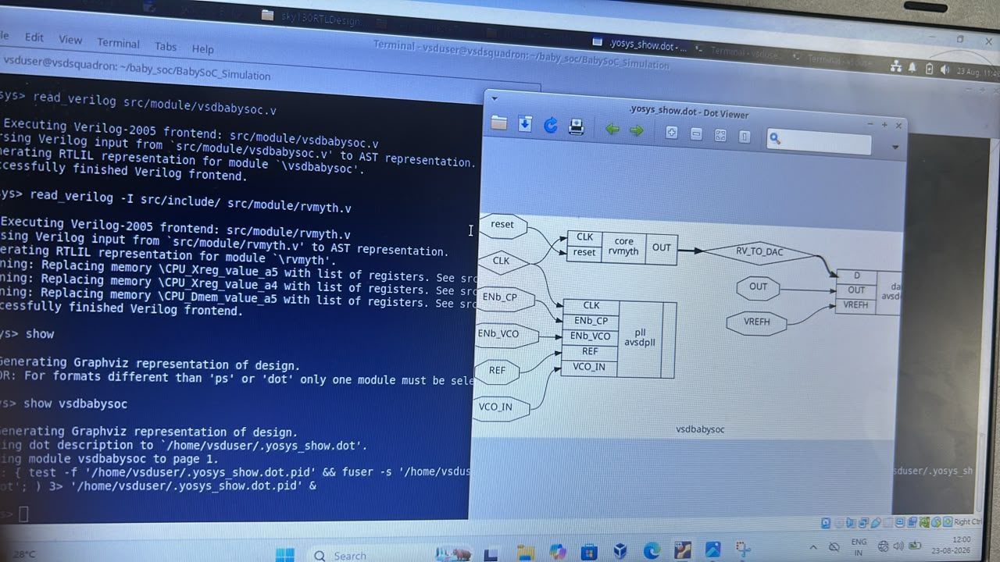
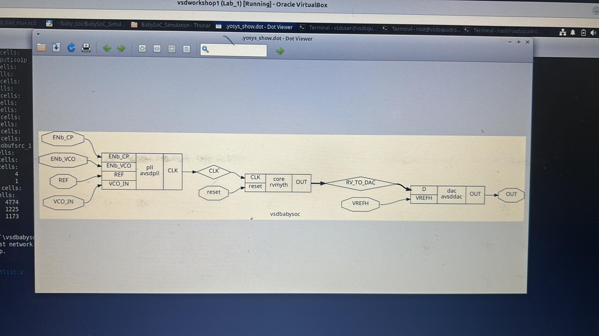
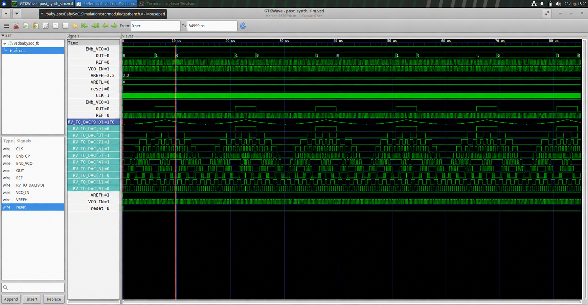
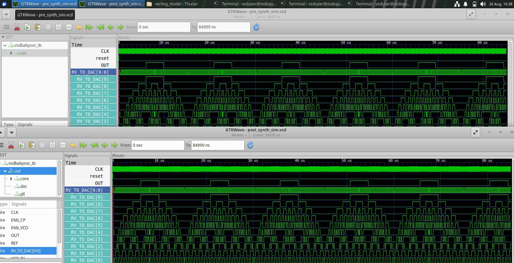

# VSDBabySoC — Pre-Synthesis vs Post-Synthesis Simulation

This project demonstrates the **Pre-Synthesis (RTL) Simulation**, **Yosys Synthesis**, and **Post-Synthesis (Gate-Level Simulation / GLS)** of the **VSDBabySoC** design.

The main objective is to verify that the synthesized gate-level design preserves the functional behavior of the original RTL design.

---

## 📋 Table of Contents

1. [Design Overview](#1-design-overview)
2. [Pre-Synthesis Simulation](#2-pre-synthesis-simulation)
3. [Synthesis Using Yosys](#3-synthesis-using-yosys)
4. [Post-Synthesis Simulation](#4-post-synthesis-simulation)
5. [Pre-Synthesis vs Post-Synthesis Comparison](#5-pre-synthesis-vs-post-synthesis-comparison)
6. [Summary of Commands](#6-summary-of-commands)
7. [Evidence](#7-evidence)
8. [Prerequisites & Tools](#8-prerequisites--tools)
9. [References](#9-references)

---

# 1. Design Overview

VSDBabySoC is a small SoC consisting of three major blocks:

| Block    | Module    | Description                                              |
| -------- | --------- | -------------------------------------------------------- |
| CPU Core | `rvmyth`  | RISC-V core generated from TL-Verilog                    |
| PLL      | `avsdpll` | Generates the clock signal                               |
| DAC      | `avsddac` | Converts the 10-bit digital output into an analog output |

### Top-Level Module

```text
src/module/vsdbabysoc.v
```

### Testbench

```text
src/module/testbench.v
```

### Signal Flow

```text
ENb_CP, ENb_VCO, REF, VCO_IN
              │
              ▼
        ┌─────────────┐
        │   avsdpll   │
        │     PLL     │
        └──────┬──────┘
               │ CLK
               ▼
        ┌─────────────┐
        │   rvmyth    │
        │ RISC-V Core │
        └──────┬──────┘
               │
         RV_TO_DAC[9:0]
               │
               ▼
        ┌─────────────┐
        │   avsddac   │
        │     DAC     │
        └──────┬──────┘
               │
               ▼
              OUT
```

---

## 📁 Repository Structure

The project is organized as follows:

```text
VSD-RTL-DESIGN-WORKSHOP/
│
├── Day6(GLS for BabySoc)/
│   ├── README.md
│   ├── post_synth_waveform.png
│   ├── yosys_schematic_terminal.png
│   ├── yosys_schematic_full_1.png
│   ├── yosys_schematic_full_2.png
│   └── pre_vs_post_synth_comparison.png
│
└── src/
    └── ...
```

> **Note:** The screenshots are stored directly inside the `Day6(GLS for BabySoc)` folder. There is no separate `images/` folder.

---

# 2. Pre-Synthesis Simulation

Pre-synthesis simulation verifies the original RTL design before synthesis.

The RTL modules used are:

* `vsdbabysoc.v`
* `rvmyth.v`
* `avsdpll.v`
* `avsddac.v`

The simulation is performed using **Icarus Verilog (`iverilog`)** and **VVP**.

The `PRE_SYNTH_SIM` macro is used to select the behavioral RTL models.

## Commands Used

```bash
cd ~/baby_soc/BabySoC_Simulation/src/module

iverilog -o pre_synth_sim.out -DPRE_SYNTH_SIM testbench.v -I ../include -I .

vvp pre_synth_sim.out
```

### Simulation Output

```text
VCD info: dumpfile pre_synth_sim.vcd opened for output.
testbench.v:63: $finish called at 84999000 (1ps)
```

The testbench runs for approximately:

```text
84,999,000 ps ≈ 85 µs
```

## Viewing the Waveform

```bash
gtkwave pre_synth_sim.vcd
```

### Signals Observed

The following signals can be observed in GTKWave:

* `CLK`
* `reset`
* `ENb_CP`
* `ENb_VCO`
* `REF`
* `VCO_IN`
* `VREFH`
* `VREFL`
* `OUT`
* `RV_TO_DAC[9:0]`

The individual bits of `RV_TO_DAC[9:0]` can also be expanded.

---

# 3. Synthesis Using Yosys

After verifying the RTL simulation, synthesis is performed using **Yosys**.

Yosys converts the RTL description into a synthesized gate-level representation.

## Commands Used

```bash
cd ~/baby_soc/BabySoC_Simulation

yosys
```

Inside Yosys:

```text
read_verilog src/module/vsdbabysoc.v
read_verilog -I src/include/ src/module/rvmyth.v
show
show vsdbabysoc
```

### Synthesized Design Structure

```text
ENb_CP ─┐
ENb_VCO ┤
REF ────┼──► avsdpll ──► CLK ──► rvmyth ──► RV_TO_DAC ──► avsddac ──► OUT
VCO_IN ─┘                                      │
                                               │
                                              VREFH
```

The synthesized structure maintains the intended connectivity:

```text
PLL → RISC-V Core → DAC
```

---

## Yosys Schematic



*Yosys synthesis commands and generated schematic.*

### Full Synthesized Schematic — View 1



### Full Synthesized Schematic — View 2


---

# 4. Post-Synthesis Simulation

Post-synthesis simulation, also called **Gate-Level Simulation (GLS)**, verifies the synthesized design.

The synthesized netlist is simulated using the same testbench.

The `POST_SYNTH_SIM` macro is used for the post-synthesis simulation.

## Commands Used

```bash
cd ~/baby_soc/BabySoC_Simulation/src/module

iverilog -o post_synth_sim.out -DPOST_SYNTH_SIM \
-I ../include -I ../gls_model \
testbench.v

vvp post_synth_sim.out

gtkwave post_synth_sim.vcd
```

The simulation generates:

```text
post_synth_sim.vcd
```

## Post-Synthesis Waveform



*Gate-level simulation waveform viewed using GTKWave.*

---

# 5. Pre-Synthesis vs Post-Synthesis Comparison

The pre-synthesis and post-synthesis simulations are compared using GTKWave.

The main signals compared are:

* `CLK`
* `reset`
* `OUT`
* `RV_TO_DAC[9:0]`

## Comparison



*Side-by-side comparison of the pre-synthesis and post-synthesis waveforms.*

## Comparison Table

| Aspect              | Pre-Synthesis (RTL)       | Post-Synthesis (GLS)   | Match                 |
| ------------------- | ------------------------- | ---------------------- | --------------------- |
| Simulation End Time | 84,999,000 ps             | 84,999,000 ps          | ✅ Yes                 |
| `CLK` Behavior      | Continuous toggling       | Continuous toggling    | ✅ Yes                 |
| `reset`             | Asserted briefly at start | Same behavior          | ✅ Yes                 |
| `OUT` Pattern       | 0 → 1 → 0 → 1...          | Same pattern           | ✅ Yes                 |
| `RV_TO_DAC[9:0]`    | Active and changing       | Same activity observed | ✅ Yes                 |
| Design Structure    | RTL modules               | Gate-level hierarchy   | Structural difference |

## Conclusion

The pre-synthesis and post-synthesis simulations demonstrate matching functional behavior.

The `OUT` and `RV_TO_DAC[9:0]` waveforms show the expected behavior in both simulations.

This indicates that the synthesis process preserved the functional behavior of the original RTL design.

The major difference is the internal representation:

```text
Pre-Synthesis:
RTL Design
     ↓
Simulation
```

```text
Post-Synthesis:
RTL Design
     ↓
Yosys Synthesis
     ↓
Gate-Level Netlist
     ↓
GLS Simulation
```

---

# 6. Summary of Commands

## Pre-Synthesis

```bash
cd ~/baby_soc/BabySoC_Simulation/src/module

iverilog -o pre_synth_sim.out -DPRE_SYNTH_SIM testbench.v -I ../include -I .

vvp pre_synth_sim.out

gtkwave pre_synth_sim.vcd
```

## Yosys Synthesis

```bash
cd ~/baby_soc/BabySoC_Simulation

yosys
```

Inside Yosys:

```text
read_verilog src/module/vsdbabysoc.v
read_verilog -I src/include/ src/module/rvmyth.v
show
show vsdbabysoc
```

## Post-Synthesis / GLS

```bash
cd ~/baby_soc/BabySoC_Simulation/src/module

iverilog -o post_synth_sim.out -DPOST_SYNTH_SIM \
-I ../include -I ../gls_model \
testbench.v

vvp post_synth_sim.out

gtkwave post_synth_sim.vcd
```

---

# 7. Evidence

The following screenshots are included in the `Day6(GLS for BabySoc)` folder.

| Screenshot                         | Description                                |
| ---------------------------------- | ------------------------------------------ |
| `post_synth_waveform.png`          | Post-synthesis / GLS waveform              |
| `yosys_schematic_terminal.png`     | Yosys commands and schematic               |
| `yosys_schematic_full_1.png`       | Full synthesized schematic — View 1        |
| `yosys_schematic_full_2.png`       | Full synthesized schematic — View 2        |
| `pre_vs_post_synth_comparison.png` | Pre-synthesis vs post-synthesis comparison |

### Post-Synthesis Waveform


### Yosys Schematic


### Synthesized Design — View 1


### Synthesized Design — View 2


### Pre vs Post Comparison


---

# 8. Prerequisites & Tools

The following tools are required:

| Tool                                | Purpose                       |
| ----------------------------------- | ----------------------------- |
| Icarus Verilog (`iverilog` / `vvp`) | RTL and gate-level simulation |
| GTKWave                             | VCD waveform visualization    |
| Yosys                               | RTL synthesis                 |
| Graphviz / `xdot`                   | Schematic visualization       |

## Installation on Ubuntu/Debian

```bash
sudo apt update

sudo apt install iverilog gtkwave yosys graphviz xdot
```

---

# 9. References

* [VSD BabySoC Workshop](https://www.vlsisystemdesign.com/)
* [RVMYTH Core](https://github.com/shivanishah269/risc-v-core)
* [Yosys Open SYnthesis Suite](https://yosyshq.net/yosys/)
* [GTKWave](http://gtkwave.sourceforge.net/)
* [Icarus Verilog](http://iverilog.icarus.com/)

---

# 🎯 Project Summary

The **VSDBabySoC** design was simulated at the RTL level, synthesized using **Yosys**, and verified using **Gate-Level Simulation (GLS)**.

The comparison between the two simulation stages demonstrates that the synthesized design maintains the expected functional behavior of the original RTL implementation.

**Flow:**

```text
RTL Design
    │
    ▼
Pre-Synthesis Simulation
    │
    ▼
Yosys Synthesis
    │
    ▼
Gate-Level Netlist
    │
    ▼
Post-Synthesis / GLS
    │
    ▼
Waveform Comparison
    │
    ▼
Functional Verification
```
