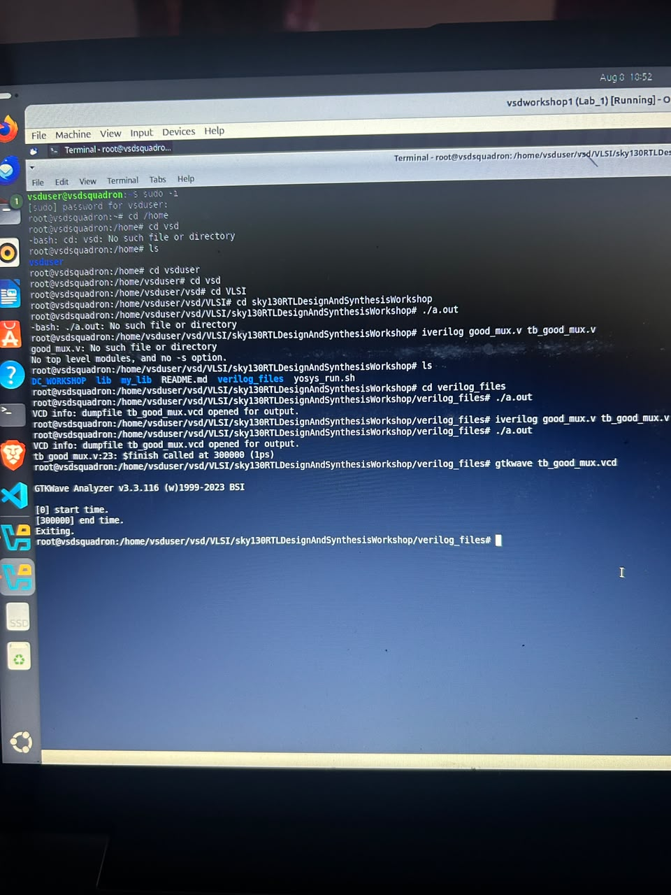

# Day 1 – Introduction to Verilog RTL Design & Logic Synthesis

This document covers the fundamentals of the digital design flow: Verilog simulation with Icarus Verilog, RTL-to-gate-level synthesis with Yosys, the SKY130 standard cell library, and the trade-offs between gate flavors.

---

## Table of Contents

- [Overview](#overview)
- [Learning Objectives](#learning-objectives)
- [1. Understanding Simulation](#1-understanding-simulation)
- [2. Icarus Verilog Simulation Flow](#2-icarus-verilog-simulation-flow)
- [3. Introduction to Yosys](#3-introduction-to-yosys)
- [4. RTL to Gate-Level Conversion](#4-rtl-to-gate-level-conversion)
- [5. Standard Cell Library](#5-standard-cell-library)
- [6. Why Different Gate Flavors are Required](#6-why-different-gate-flavors-are-required)
- [7. Yosys Synthesis Flow](#7-yosys-synthesis-flow)
- [Key Takeaways](#key-takeaways)

---

## Overview

Day 1 introduces the complete digital design flow, starting from Verilog simulation and progressing to logic synthesis. This covers the purpose of simulation, the role of a testbench, and how RTL designs are synthesized into gate-level implementations using **Yosys** and the **SKY130** standard cell library.

Hands-on labs were performed using **Icarus Verilog** for simulation and **Yosys** for synthesis, using the `good_mux` design as the working example throughout.

---

## Learning Objectives

- Introduction to the digital design flow
- Understanding the role of a simulator
- Difference between Design and Testbench
- Icarus Verilog simulation flow
- Basics of Yosys synthesis
- How to verify a synthesized netlist
- Standard cell library concepts
- Importance of different gate flavors
- Basic synthesis commands

---

## 1. Understanding Simulation

Before implementing any hardware, the functionality of an RTL design must be verified. Simulation checks whether the design behaves according to specification **before** it is synthesized. Three components are central to this process:

| Component | Description |
|---|---|
| **Simulator** | A tool that executes the RTL design together with the testbench, applying inputs and capturing outputs. The simulator only re-evaluates the design's outputs when an input changes — this is why the testbench must explicitly generate input transitions. If no input changes, no output is evaluated. |
| **Design** | The RTL module written in Verilog that describes the intended hardware behavior. This is the code that will eventually be synthesized into hardware. |
| **Testbench** | A separate Verilog module that generates input stimulus for the design and, optionally, checks or displays the resulting outputs. It is used purely for verification and is **never synthesized** into hardware. |

The overall idea: the testbench applies known input combinations to the design, the simulator evaluates the design's response, and the resulting output values are recorded (as a VCD file) for visual inspection in a waveform viewer.

---

## 2. Icarus Verilog Simulation Flow

The complete simulation flow using **Icarus Verilog (`iverilog`)** consists of:

1. Writing the RTL design.
2. Writing the testbench.
3. Compiling both files together using Icarus Verilog.
4. Running the generated executable, which produces a `.vcd` waveform file.
5. Viewing the generated waveform using **GTKWave**.

This process verifies whether the RTL behaves as expected before moving on to synthesis.

### Good Mux RTL Simulation

The `good_mux` module was simulated using Icarus Verilog to verify its functionality before synthesis.

**Simulation Commands**

```bash
iverilog good_mux.v tb_good_mux.v
./a.out
```

**Figure 1: Good Mux Simulation Output**




The terminal output confirms that the design and testbench compiled and executed successfully, generating a `.vcd` file for waveform viewing.

**GTKWave Waveform**

The generated VCD file was opened in GTKWave to verify the functional behavior of the multiplexer.

```bash
gtkwave tb_good_mux.vcd
```

The waveform confirms that the output `y` follows the selected input according to the value of `sel`:

- When `sel = 0`, the output `y` follows `i0`.
- When `sel = 1`, the output `y` follows `i1`.

This confirms the RTL implementation behaves correctly **before** synthesis.

---

## 3. Introduction to Yosys

**Yosys** is an open-source RTL synthesis tool. Unlike simulation, which only verifies functionality, Yosys converts the RTL description into a **gate-level implementation** using cells available in a standard cell library.

The synthesized netlist performs the same functionality as the original RTL, but is now represented as an interconnection of real logic gates that can actually be implemented in silicon.

### Verifying the Synthesized Netlist

A synthesized netlist must be checked to confirm that synthesis has not changed the design's functionality. This is done the same way RTL was verified:

- The same testbench used for RTL simulation is re-used, this time simulating the **gate-level netlist** together with the SKY130 primitive cell models instead of the original behavioral RTL.
- The resulting waveform is compared against the original RTL waveform.
- If both waveforms match, the synthesis is functionally correct — this step is known as **Gate-Level Simulation (GLS)**.

This is why, in Section 1, it was important that the testbench only depends on the module's input/output ports and not on its internal implementation — the same testbench works unchanged for both RTL and gate-level verification.

---

## 4. RTL to Gate-Level Conversion

| RTL | Synthesis |
|---|---|
| Describes the **behavior** of the circuit | Transforms behavior into interconnected **logic gates and flip-flops** |

Although the internal implementation changes after synthesis, functionality remains identical — which is why the **same testbench** can verify both the RTL design and the synthesized netlist.

### Synthesizing the Good Mux Design

```bash
yosys

read_liberty -lib ../lib/sky130_fd_sc_hd__tt_025C_1v80.lib

read_verilog good_mux.v

synth -top good_mux

abc -liberty ../lib/sky130_fd_sc_hd__tt_025C_1v80.lib

write_verilog -noattr good_mux_net.v
```

The synthesized netlist shows the `good_mux` RTL description implemented as an interconnection of standard cells from the SKY130 library, rather than a behavioral `always`/`assign` statement. This netlist is what gets carried forward into gate-level simulation and physical implementation.

---

## 5. Standard Cell Library

Synthesis requires a **standard cell library**, which contains the pre-characterized logic gates used to build the final hardware implementation.

The workshop used the **SKY130 HD Standard Cell Library**, which provides multiple implementations of common gates (AND, OR, NAND, NOR, XOR) and flip-flops. Each gate is available in several versions — called **flavors** — with different timing, power, and area characteristics.

---

## 6. Why Different Gate Flavors are Required

Different flavors of the same logic gate let the synthesis tool optimize the circuit for specific design requirements, rather than being locked into a single trade-off.

### Faster Cells

Faster cells have lower propagation delay and are selected for timing-critical paths that need to run at higher operating frequency.

| Advantages | Trade-offs |
|---|---|
| Lower delay | Higher power consumption |
| Higher operating frequency | Larger silicon area |
| Better timing performance | |

### Slower Cells

Slower cells consume less power and occupy smaller area, at the cost of higher delay. They are useful on paths that are not timing-critical, and are also important for fixing **hold-time violations**.

| Advantages |
|---|
| Lower power consumption |
| Reduced chip area |
| Helps satisfy hold-time requirements |

### Cell Selection

During synthesis, the tool automatically selects an appropriate mix of fast and slow cells for each part of the circuit, based on:

- Timing constraints (setup and hold requirements)
- Power optimization goals
- Area constraints

Balancing fast and slow cells across the design produces an implementation that meets timing without unnecessarily inflating power or area — this is the essence of the cell selection performed automatically during synthesis.

---

## 7. Yosys Synthesis Flow

The hands-on lab followed this general synthesis flow:

1. Load the standard cell library (`read_liberty`).
2. Read the Verilog RTL design (`read_verilog`).
3. Specify the top-level module (`synth -top`).
4. Perform technology mapping using `abc`.
5. Generate the synthesized gate-level netlist (`write_verilog`).

This demonstrates how RTL descriptions are translated into structural, gate-level hardware ready for downstream physical implementation.

---

## Key Takeaways

- Simulation verifies RTL functionality **before** synthesis, using a simulator, a design, and a testbench.
- The simulator only evaluates outputs when an input changes — the testbench is responsible for driving those changes.
- A testbench generates stimulus and observes outputs but is never synthesized into hardware.
- The Icarus Verilog flow: write RTL → write testbench → compile → run → view waveform in GTKWave.
- Yosys converts RTL behavior into a gate-level netlist using cells from a standard cell library.
- A synthesized netlist is verified through Gate-Level Simulation (GLS), reusing the same testbench and comparing waveforms against the RTL simulation.
- The SKY130 HD library provides multiple gate flavors trading off delay, power, and area.
- Fast cells minimize delay at the cost of power/area; slow cells save power/area and help meet hold-time requirements.
- Cell selection during synthesis automatically balances these trade-offs to meet the design's timing, power, and area goals.